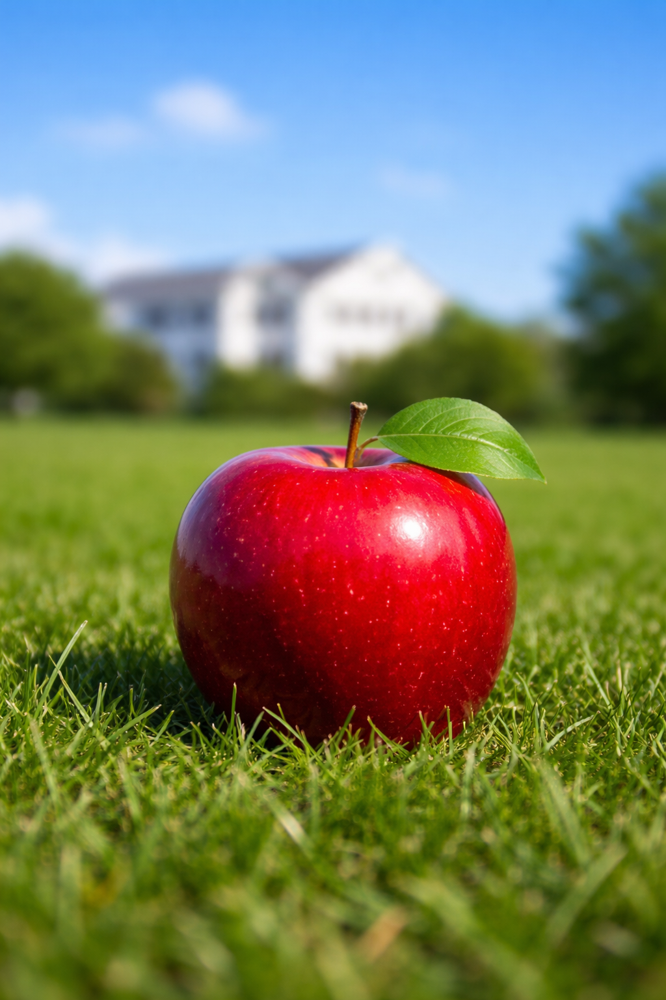
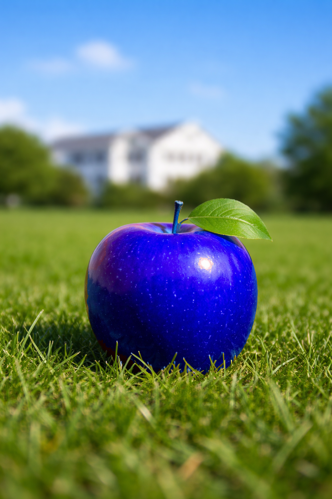

Please convert the RED apple into a BLUE one, by using HSI/HSV transform.

請利用HSI或HSV的轉換，更換color space之後，將附檔圖片內的紅蘋果(紅色色調區域)，轉變成藍蘋果(藍色色調)。

Channel-swapping is not allowed! 
(不可以利用channel-swapping來交作業，但是可以用channel-swapping來體會紅蘋果變藍蘋果的樣子。)

---

轉換完成觀察：
紅蘋果成功轉換成藍蘋果，但問題是連天空、雜草的顏色的跟著轉移，也就是隨著色盤轉240/360，如果先將原圖的紅色框出來再轉換應該會比較好

轉換完成觀察：
紅蘋果成功轉換成藍蘋果，且雜草的顏色沒有跟著轉移，實現方法是透過局部調整HSV的值，講白話就是手動調參，一直試到黃色的部份比較步容易被轉換。整體來說，除了蘋果本身一點點紅色的地方調不掉，其他地方視覺上都還不錯。

[HSV筆記](hsv.pdf)：
一些關於HSV和HSI基本的學習內容筆記，跟之後程式碼內容的轉換公式。